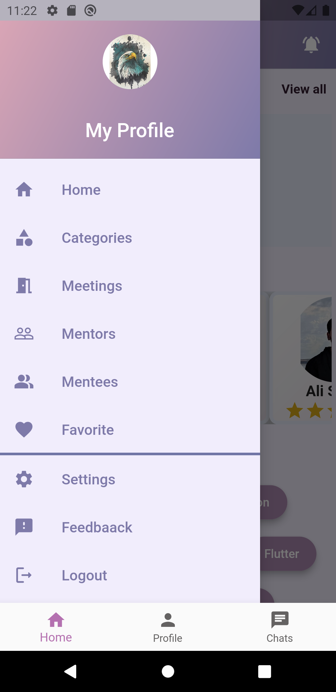

 

# M2M App
   
 
 The purpose of creating this project; to enable mentees to find their mentors.

## Key Features:
* Mentors-Mentees who are linked to each other are listed on the main page. Also most popular tags are listed on the main page.
* Mentees can rate and comment on mentors.
* Mentors are listed as Top Mentors on the homepage based on their scores. Scores are ranked according to the points given by the mentees.
* Either mentors or mentees can create an event for meeting.
* Users can acces their meetings from drawer.
* We can access mentors-mentees profile page and their information.
* On the profile page, the profile owner's name, profile picture, user's rating, comments, etc. information is included.
* In the App, user login, registration, connecting, choosing to be a mentor or a mentee, etc. features are available.
* Users can contact the admin with the FeedBack feature and the feedback will be considered.
* Communication in infrastructure is created with REST API. REST API was written by our team.

 ## Used technologies:
* Server platform: NodeJS (Sequelize) 
* Database: PostgreSQL
* HTML Template Engine: Visual Studio Code
* Programming Language: Javascript, Dart
* Version Control: Git
* Communication: REST API
* Interface Framework: Flutter
* Emulator Provider: Android Studio
* API Test: Postman 

## How To Use

• Clone this project your computer.

• Open project folder.Open 2 terminal.

• For first terminal, go to client folder and run `flutter pub get` command.

• For second terminal, go to server folder and run `npm install` command.

• In `/server/database/index.js` file, enter your database informations for connect with database.

• In `.env` file, enter your informations for configuration.

• `JWT_SECRET= enter secret key what you want`

• `SMTP_USER= enter email for admin`

• `SMTP_PASSWORD= enter email password for admin`

• `TO_MAIL= enter email for persons who wants to contact with you`

• When the installations finish, run `npm start` command in the server side terminal. After that, run client side with Emulator or what you want.

## Screenshots

## License
[MIT](https://choosealicense.com/licenses/mit/)
